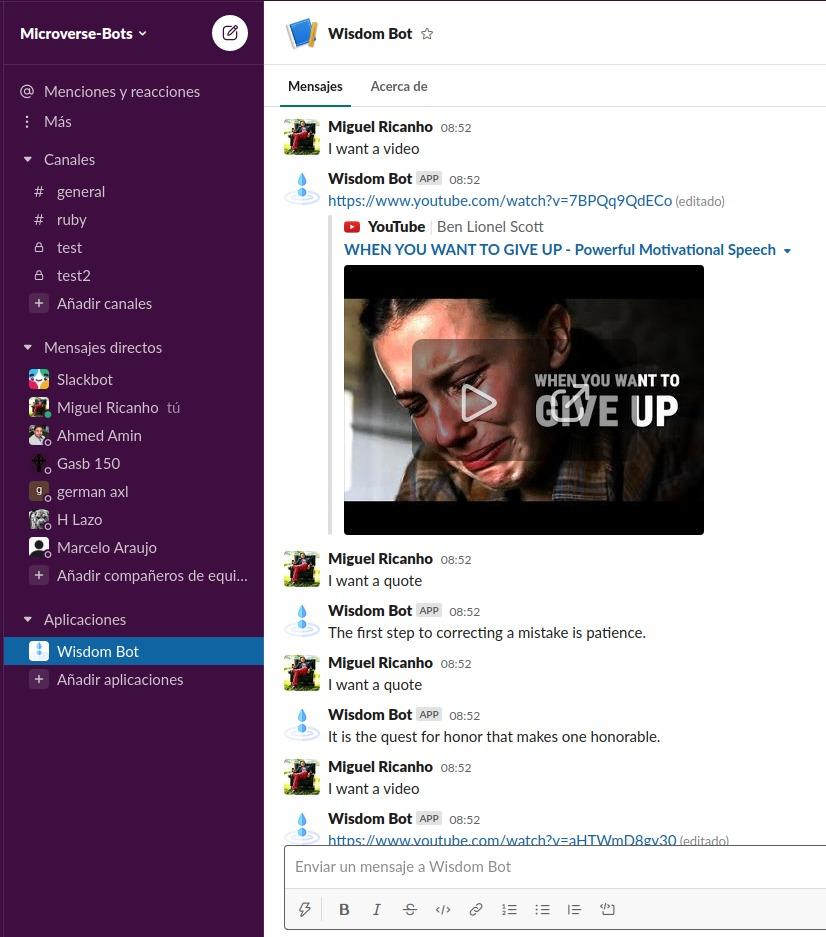

# Wisdom_Slackbot
This is my capstone project, a Wisdom Bot that runs on Slack.

Sometimes there are moments when we feel down, not wanting to continue our work, either because it is too much or because it's too complicated, this discourages us, until now.

Wisdom Bot was created to motivate you to finish the day.

The bot can deliver either a video that will help you with an ample spectred of topics or a short but insightful quote that will gradually redefine your mental paths.



## Built With

- Ruby v 2.7
- Rainbow gem
- TTY font gem
- Async-Websocket v 0.8.0 gem
- Slack-Ruby-Bot gem
- Slack-Ruby-Client gem
- Puma gem
- Dotenv gem

### Setup

To run this project locally, please ensure you have Ruby installed on your machine, then clone this repository by running.

```bash
git clone https://github.com/mricanho/Wisdom_Slackbot
```
After this, you have to create a slack channel to set up the bot.

You can achieve it [here](https://github.com/mricanho)

https://slack.com/get-started#/create

### Instructions
### Author

👤 <b>Miguel Ricaño</b>

- Github: [@mricanho](https://github.com/mricanho)
- Linkedin: [Miguel Ricaño](https://www.linkedin.com/in/mricanho/)


## Show your support

Give a ⭐️ if you like this project!

## Acknowledgments

- Microverse
- The Odin Project

## 📝 License

This project is [GNU](LICENSE.md) licensed.