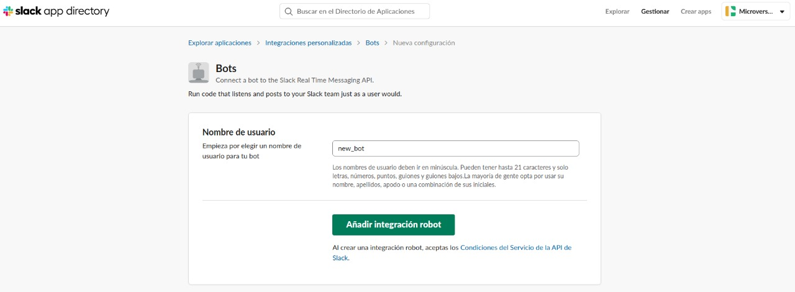
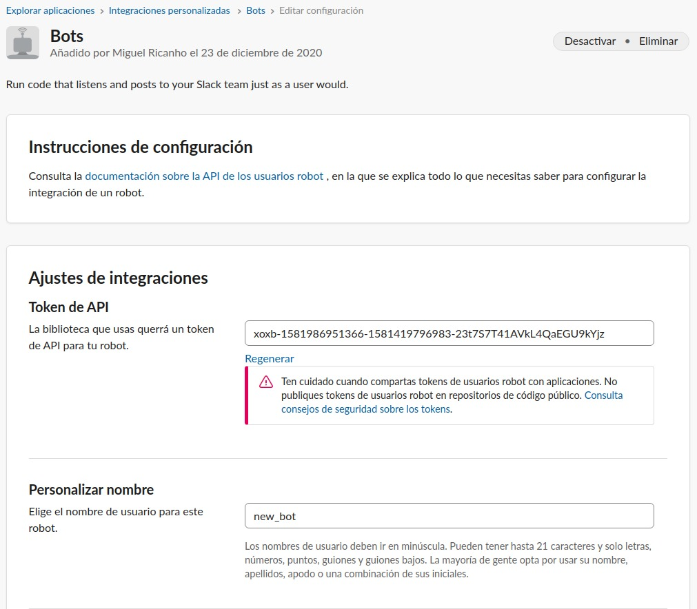
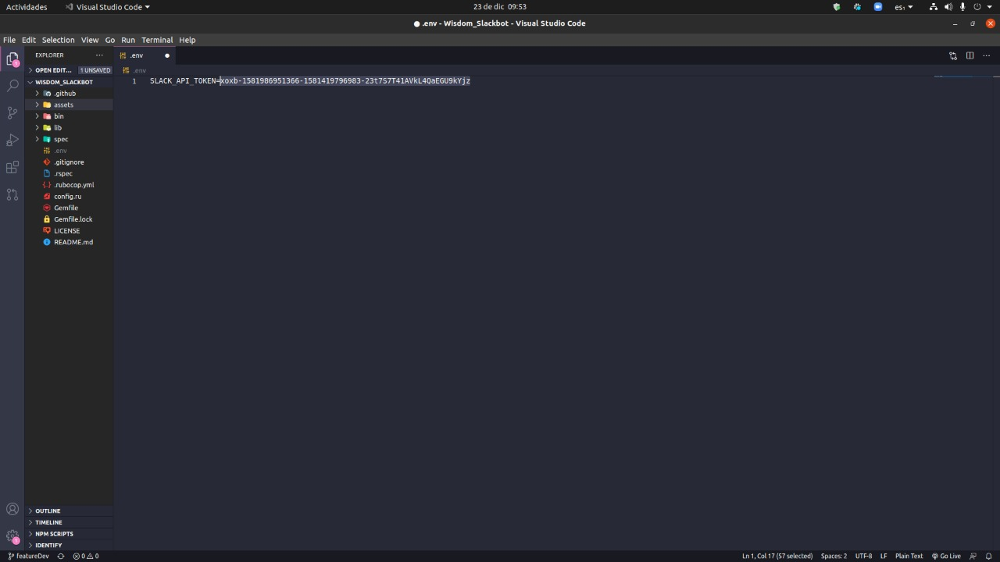
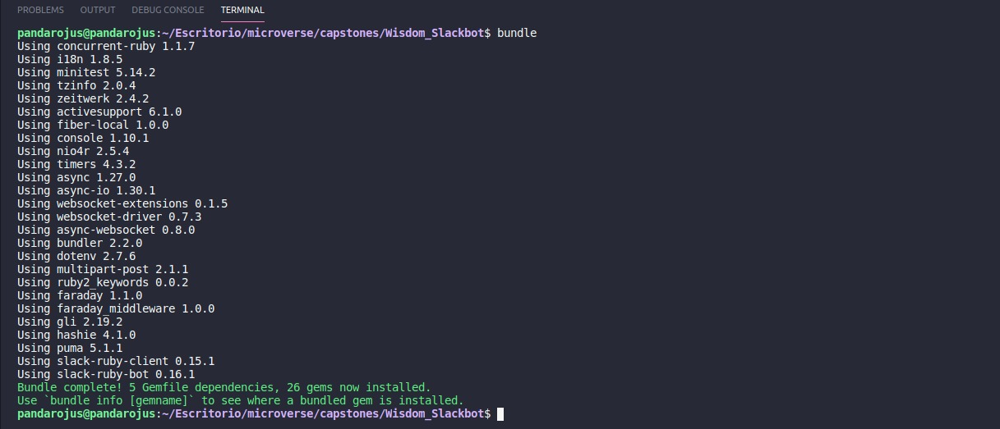
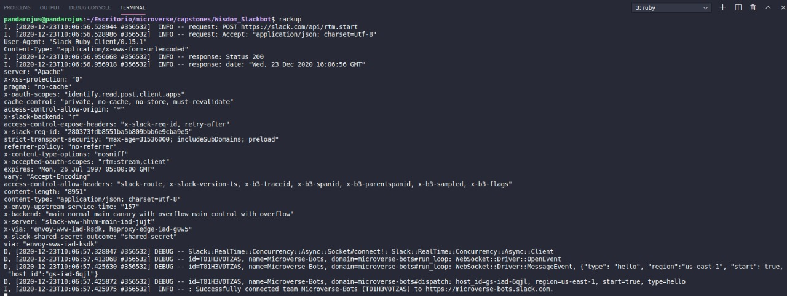

# Wisdom_Slackbot
This is my capstone project, a Wisdom Bot that runs on Slack.

Sometimes there are moments when we feel down, not wanting to continue our work, either because it is too much or because it's too complicated, this discourages us, until now.

Wisdom Bot was created to motivate you to finish the day.

The bot can deliver either a video that will help you with an ample spectred of topics or a short but insightful quote that will gradually redefine your mental paths.


## Built With

- Ruby v 2.7
- Rainbow gem
- TTY font gem
- Async-Websocket v 0.8.0 gem
- Slack-Ruby-Bot gem
- Slack-Ruby-Client gem
- Puma gem
- Dotenv gem

### Set up

To run this project locally, please ensure you have Ruby installed on your machine, then clone this repository by running.

```bash
git clone https://github.com/mricanho/Wisdom_Slackbot
```
After this, you have to create a slack channel to set up the bot.

- You can achieve it [here](https://slack.com/get-started#/create).

Once you have your Slack channel to display the bot, you have to register a bot to get the Slack API Token.



- You can achieve it [here](http://slack.com/services/new/bot).

When you completed the step above, you will have the API Token of the new bot.



Copy the API Token and go back to your text editor

- Create a '.env' file and place the API token in there.



- It's super important that you place 'SLACK_API_TOKEN=' before the API Token.

The '.env' file it's connected to the '.gitignore' file that comes with the repository, it will protect your API token, and only you can see it.

- Now open your terminal, go to the local directory of your repository, and enter 'bundle'.



This will install all the gems on your local machine.

The last step is to set up the local server, and it's super easy with gems we installed before. 

- Open your terminal, go to the local directory of your repository, and enter 'rackup'.



That's it, now your bot is connected to Slack, up and running! 

As long as your terminal is open and running, the bot will work.

### Instructions
### Author

👤 <b>Miguel Ricaño</b>

- Github: [@mricanho](https://github.com/mricanho)
- Linkedin: [Miguel Ricaño](https://www.linkedin.com/in/mricanho/)


## Show your support

Give a ⭐️ if you like this project!

## Acknowledgments

- Microverse
- The Odin Project

## 📝 License

This project is [GNU](LICENSE.md) licensed.